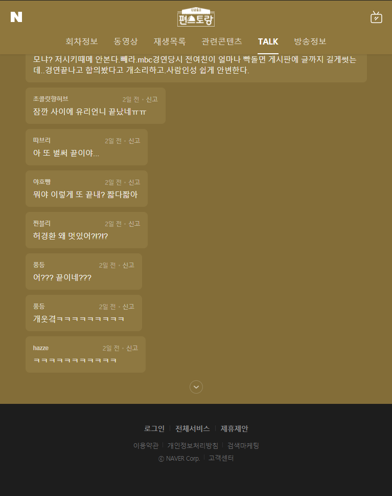

```{r setup, include = FALSE}
knitr::opts_chunk$set(warning = FALSE, fig.align = "center", 
                      fig.height = 8, fig.width = 8,
                      out.width = "100%")
```

초기 데이터 분석 목표는 상품별로 광고 효과가 좋은 프로그램을 추천해주는 서비스를 만들고 싶었습니다. 하지만 시간과 기술의 한계로, 매체와 관련된 데이터 수집 및 시각화를 해 보는 것으로 목표를 수정했습니다.

전체적인 요약은 다음과 같습니다.

-   TV 프로그램에 대한 시청자의 반응을 알 수 있는 네이버 TALK 서비스를 크롤링했습니다. 크롤링을 통해 얻은 데이터로 출현 빈도가 높은 단어를 추출했습니다. 그 중에서 빈출 키워드를 뽑아 감정분석을 실시했습니다. (포스팅 1부)

-   Wikipedia에서 2019 년 방영한 TV 프로그램의 정보를 크롤링했습니다. 또한 네이버에서 시청률 정보를 가져와 하나의 데이터프레임으로 정리했습니다. (포스팅 2부)

-   2019 년 한국방송광고진흥공사에서 발표한 소비자행태조사(MCR) 데이터를 분석했습니다. 모든 제품/서비스를 통틀어 소비자의 구매에 가장 영향을 주는 매체는 '지상파채널' 이었습니다. 조사 제품군 중 하나인 간편식 구매에 있어 광고 효율이 좋은 것은 관련 기사, 옥외/대중교통 등이 있었습니다. (포스팅 3부)

# 1. TV 프로그램 네이버 톡 크롤링

## 1.1. Selenium으로 데이터 크롤링

Selenium을 통해 동적인 웹을 크롤링했습니다. 네이버 측에서 좋아하지 않겠지만, 연습을 위해서 크롤링 해보았습니다.<br> 우선 chromedriver를 다운로드 받고 적당한 경로에 둔 다음, driver를 불러 와 원하는 웹사이트에 접속합니다.

```{python, eval = FALSE}
from selenium import webdriver
```

```{python, eval = FALSE}
path = r"C:\Users\TFG5076XG\Documents\pythoncodes\chromedriver.exe"
```

```{python, eval = FALSE}
driver = webdriver.Chrome(path)
```

```{python, eval = FALSE}
driver.implicitly_wait(2) # 초 단위로 기다림
driver.set_window_size(600,800) # 창 크기 조절
```

```{python, eval = FALSE}
url = "https://program.naver.com/p/10229879/talk"
```

```{python, eval = FALSE}
driver.get(url)
```

<center>



</center>

위 페이지에서는 page만큼 버튼을 눌러 모든 댓글을 html에 담은 다음 html 내에서 원하는 정보를 가져오는 방식으로 진행했습니다.

```{python}
n_of_talk = 39682
```

```{python}
page_num = (n_of_talk // 20) + 1
page_num
```

```{python, eval = FALSE}
for num in range(page_num):
    driver.\
    find_element_by_xpath('//*[@id="cbox_module"]/div/div[7]/a/span/span/span[2]').\
    click()
```

```{python, eval = FALSE}
html = driver.page_source
```

```{python, eval = FALSE}
soup = BeautifulSoup(html, "html.parser")
```

```{python, eval = FALSE}
comments = soup.find_all("span", class_="u_cbox_contents")
```

```{python, eval = FALSE}
comments_df = pd.DataFrame(comments)
comments_df["text"] = comments_df.iloc[:,0].\
apply(lambda x: x.text)
comments_df.columns = ["tag", "text"]
```

텍스트 전처리 과정은 다음의 순서를 따랐습니다.<br> 최대한 형태소 분석기가 형태소 별로 단어를 잘 분리할 수 있도록 만들기 위해 노력했습니다.

-   이모티콘 제거

-   기타 부호 제거

-   제거 후 0의 길이를 가진 리뷰 제거

-   spell_checker를 통해 맞춤법 검사 후 변경

```{python, eval = FALSE}
comments_df = pd.read_csv("comments.csv")
comments_df.drop(["Unnamed: 0", "tag"], axis = 1,
                inplace = True)
comments_df.dropna(inplace = True)

comments_df.head()
```

```{python, eval = FALSE}
t1 = time.time()
comments_df["text"] = comments_df["text"].\
apply(lambda x: demoji.replace(x, ""))
t2 = time.time()
print("작업 끝:",t2-t1)
```

```{python, eval = FALSE}
t1 = time.time()
comments_df["text_mark_rm"] = comments_df["text"].\
apply(lambda x: re.sub("[-=.#/?:&$}~^]", "", x))
t2 = time.time()
print("작업 끝:",t2-t1)
```

```{python, eval = FALSE}
comments_df["text_checked"] = ""
```

```{python, eval = FALSE}
idx_text_checked = comments_df.columns.get_loc("text_checked")
idx_text_mark_rm = comments_df.columns.get_loc("text_mark_rm")
```

```{python, eval = FALSE}
comments_df["text_len"] = \
comments_df["text_mark_rm"].apply(lambda x: len(x))
```

```{python, eval = FALSE}
comments_df = comments_df[comments_df["text_len"] != 0]
```

```{python, eval = FALSE}
i = 1
while i <= len(comments_df):
  try:
      print(i)
      comments_df.iat[i, idx_text_checked] = \
      spell_checker.\
      check(comments_df.iat[i, idx_text_mark_rm]).checked
  except:
      print(i, ":", comments_df["text_mark_rm"].iloc[i])
  i = i + 1
```

## 1.2. 라이브러리 및 기본 설정

```{r, message=FALSE}
library(showtext)
font_add_google('Gothic A1', 'gothicA1')
showtext_auto()
library(tidyverse)
library(KoNLP)
`%notin%` <- Negate(`%in%`)
library(ggwordcloud)
library(RColorBrewer)
library(tidytext)
```

## 1.3. 데이터 불러오기

이를 통해 만들어진 컬럼들은 다음과 같습니다.

-   text: 원본 텍스트

-   text_mark_rm: text에서 특수기호 제거 텍스트

-   text_checked: text_mark_rm에서 맞춤법 검사 텍스트

-   text_len: text_mark_rm 문자열의 길이

```{r, message= FALSE}
comments_edited = read_csv("comments_edited.csv")
comments_edited = comments_edited %>% 
  select(-c(X1))
```

```{r}
head(comments_edited)
```

## 1.4. 워드클라우드 준비

-   KoNLP 패키지를 통해 형태소 분석합니다.

-   위치, 브랜드에 대한 정보를 가지고 있는 Insighter 사전를 이용했습니다. ([링크](https://htmlpreview.github.io/?https://github.com/haven-jeon/NIADic/blob/master/NIADic/vignettes/insighter-dic.html))

-   불용어를 제거합니다. [(불용어 리스트)](https://github.com/koheiw/marimo/blob/master/yaml/stopwords_ko.yml)

-   빈출 단어 내에 모호한 단어를 변경합니다.

```{r}
comments_edited$symbol_removed = str_replace_all(comments_edited$text_checked, "[ㅜㅠㅡㅋㄷㅎㅉz!;]{1,}", "") # 반복 단어 삭제
```

```{r}
# NIA의 Insighter Dictionary 사용
buildDictionary(ext_dic = c('insighter'),
                user_dic = data.frame(term=c("이유리","편스토랑"),                    tag=c('ncn',"ncn")),
                replace_usr_dic = TRUE
                )
```

```{r}
# 명사 추출 데이터 리스트 생성
noun = extractNoun(comments_edited$symbol_removed)
noun_list = unlist(noun)
```

```{r}
noun_list_count = table(noun_list)
```

```{r}
result = noun_list_count %>% 
  as_tibble() %>% 
  arrange(desc(n)) 
result
```

```{r}
# 불용어 사전
comments_stopwords = stopwords::stopwords("korean", source = "marimo")
```

```{r}
comments_stopwords = append(comments_stopwords, c("님"))
```

```{r}
# 불용어 제거 및 100번 이상 출현 단어
result_edit = result %>%
  filter(nchar(noun_list) > 1) %>% 
  filter(noun_list %notin% comments_stopwords 
         & n >= 100)
```

```{r}
word.freq = result_edit %>% 
  rename(word = noun_list,
         freq = n)
```

```{r}
word.freq[["word"]][word.freq[["word"]] == "스토"] = "편스토랑"
word.freq[["word"]][word.freq[["word"]] == "스토랑"] = "편스토랑"
word.freq[["word"]][word.freq[["word"]] == "이유"] = "이유리"
```

```{r}
word.freq
```

## 1.5. 출현 빈도 상위 20개 단어

```{r}
top20 = word.freq %>% 
  head(20)
```

```{r}
ggplot(data = top20,
        mapping = aes(x = reorder(word, freq), y = freq)) +
  geom_col(mapping = aes(fill = freq)) +
  coord_flip() +
  geom_text(aes(label = freq), hjust = -0.2) +
  labs(x = NULL, y = NULL) +
  ggtitle("단어 빈도 상위 20 개 단어") + 
  theme(plot.title = element_text(hjust = 0.5),
        legend.position = "none")
```

## 1.6. 워드 클라우드

```{r}
ggplot(data = word.freq, 
       mapping = aes(label = word, size = freq, color = freq)) +
  geom_text_wordcloud(area_corr = TRUE,
                      grid_size = 64,
                      max_grid_size = 64) +
  scale_size_area(max_size = 16) +
  theme_minimal()
```

편스토랑 프로그램이 '요리'와 관련이 있다보니, '요리' 키워드가 많이 나왔습니다. 그리고 출연자들의 아이디어로 진행되는 프로그램이다 보니 출연자들의 이름도 많이 언급되었습니다.

<center>


</center>

## 1.7. 대표 키워드 감정분석

-   '이유리' 키워드 관련 문장을 추출했습니다.

-   KNU 한국어 감성사전을 활용했습니다. [(링크)](http://dilab.kunsan.ac.kr/knusl.html)

    -   polarity: 단어의 긍부정 척도

-   문장별 감정점수를 산출했습니다.

```{r}
temp = comments_edited %>% 
  select(symbol_removed)
```

```{r}
temp_sentences = temp %>% 
  unnest_tokens(input = symbol_removed,
                output = sentence,
                token = "sentences")
```

```{r}
comments_yuri = temp_sentences %>% 
  filter(str_detect(sentence, "이유리"))
```

```{r}
head(comments_yuri)
```

```{r, message=FALSE}
dic = read_csv("knu_sentiment_lexicon.csv")
```

```{r}
dic %>% 
  filter(polarity == 2) %>% 
  arrange(word)
```

```{r}
table(dic$polarity)
```

```{r}
head(comments_yuri)
```

```{r}
comments_yuri = comments_yuri %>% 
  unnest_tokens(input = sentence,
                output = "word",
                token = "words",
                drop = FALSE)
```

```{r}
comments_yuri = comments_yuri %>% 
  left_join(dic, by = "word") %>% 
  mutate(polarity = 
           ifelse(is.na(polarity), 0, polarity))
```

```{r}
score_df = comments_yuri %>% 
  group_by(sentence) %>% 
  summarise(score = sum(polarity))
```

```{r}
score_df = score_df %>% 
  arrange(desc(score))
```

```{r}
score_df
```

```{r}
paste("평균 점수:",round(mean(score_df$score),2))
paste("긍정 리뷰 수:",sum(score_df$score > 0)) 
paste("부정 리뷰 수:",sum(score_df$score < 0))
```

```{r}
score_df[["sentence"]][[1]] # 감정점수가 가장 높은 댓글 (긍정으로 분류)
```

```{r}
score_df[["sentence"]][[nrow(score_df)]] # 가장 부정적인 댓글 (부정으로 분류)
```

감정점수가 가장 높았던 댓글과 부정적인 댓글을 직접 확인해 볼까요? <br> 확인할 수 있듯이 점수가 가장 높다고 가장 긍정적인 내용의 댓글이라고 할 수 없음을 알 수 있습니다.<br> 정밀한 텍스트 분석을 위해서는 다른 방법을 찾아야 할 것으로 보입니다.
