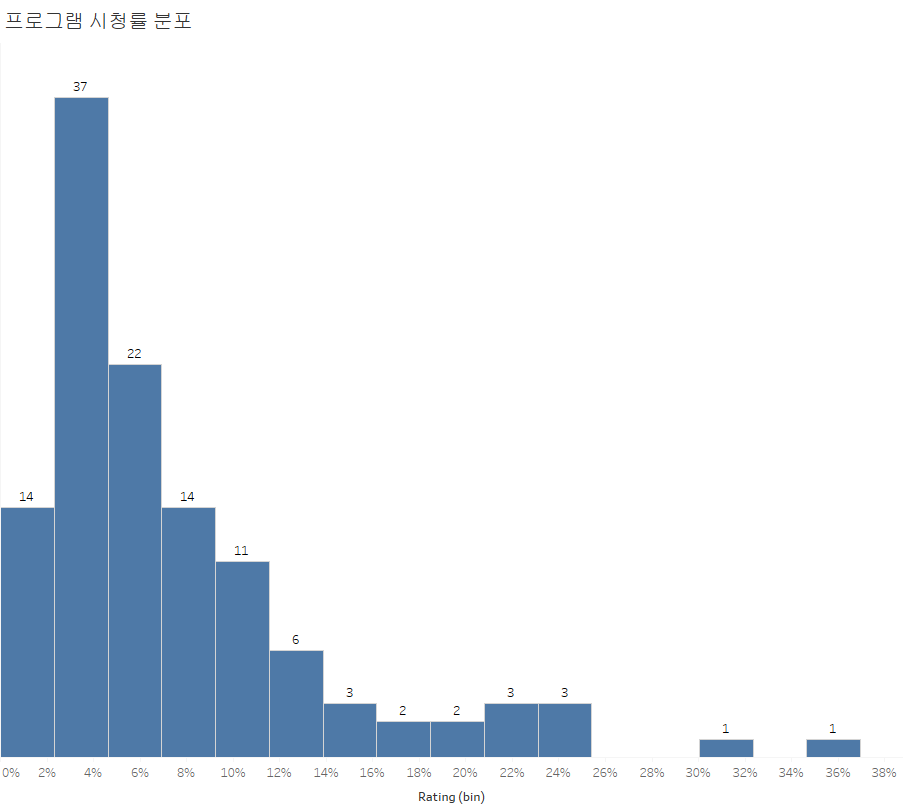

```{r setup, include = FALSE}
knitr::opts_chunk$set(warning = FALSE, fig.align = "center", 
                      fig.height = 8, fig.width = 8,
                      out.width = "100%")
```

# 2. Wikipedia에서 TV 프로그램 정보 수집

상품별 프로그램 추천을 위해서는 프로그램 정보가 있어야 합니다.<br>
그래서 Wikipedia를 통해 과거 예능, 드라마 TV 프로그램 정보를 가지고 오는 실습을 해 보려고 합니다.<br>
사용하는 라이브러리는 urllib, BeautifulSoup 등이 있습니다.

## 2.1. 라이브러리 불러오기

```{python}
import pandas as pd
import numpy as np
import re
from bs4 import BeautifulSoup
import urllib.request
from urllib import parse
```

직접 프로그램 목록을 작성하여 엑셀 파일로 만들었습니다.

## 2.2. 프로그램 목록 데이터 가져오기

```{python, eval = F}
programs = pd.read_excel(r"C:\Users\TFG5076XG\Documents\pythoncodes\data\프로그램 목록.xlsx")
```

## 2.3. 데이터 크롤링

크롤링 과정은 다음과 같은 순서로 진행했습니다.

-   위키피디아, 네이버 크롤링
-   한글 프로그램명을 url에 덧붙이기 위해 파싱
-   BeautifulSoup 활용
-   정보가 없을 때 예외 처리

```{python, eval = F}
baseurl = "https://ko.wikipedia.org/wiki/"
```

```{python, eval = F}
programs["suburl"] = programs["프로그램명"].apply(lambda x: re.sub(" ", "_", x))
```

```{python, eval = F}
programs["quote"] =  programs["suburl"].apply(lambda x: parse.quote(x))
```

```{python, eval = F}
programs["url"] = baseurl + programs["quote"]
```

```{python, eval = F}
programs["values"] = ""
```

```{python, eval = F}
dramas = pd.read_csv("dramas_df.csv")
dramas = dramas.drop("Unnamed: 0", axis = 1)
dramas.columns.values[0] = "프로그램명"
```

```{python, eval = F}
programs = pd.concat([programs.drop(["suburl","quote"], axis = 1), dramas], axis = 0, ignore_index=True)
```

```{python, eval = F}
programs["values"][programs["values"].isnull()] =  ""
```

<center>


</center>

위의 사진처럼 표에 TV 프로그램에 대한 정보가 들어 가 있습니다. <br>
주의해야 할 점은 TV 프로그램마다 표의 속성 길이가 다르기 때문에 예외 처리를 해 주어야 합니다.

```{python, eval = F}
idx = 0

for link in programs["url"]:
    dic = dict()

    page = urllib.request.urlopen(link).read().decode("utf-8")
    soup = BeautifulSoup(page, "html.parser")

    for i in range(len(soup.find("table").find_all("tr"))):
        if len(soup.find("table").find_all("tr")[i].find_all("th")) != 0:
#             print(soup.find("table").find_all("tr")[i].find("th").text,
#                   soup.find("table").find_all("tr")[i].find("td").text.strip())
            dic[soup.find("table").find_all("tr")[i].find("th").text.strip()] = \
            soup.find("table").find_all("tr")[i].find("td").text.strip()
#             print("------")
        else:
            pass
    programs["values"][idx] = dic
    idx += 1
```

<center>


</center>

또한 네이버에서 프로그램의 시청률 정보를 크롤링 해 주었습니다. <br>
여기도 정보가 없는 곳은 에러를 방지하기 위해 try, except 문으로 예외처리를 해 줍니다.

```{python, eval = F}
programs["rating"] = ""
```

```{python, eval = F}
idx_rating = programs.columns.get_loc("rating")
```

```{python, eval = F}
for i in range(len(programs)):
    word_parsed = parse.quote(programs["프로그램명"][i])
    naver_url = naver_baseurl + word_parsed
    html = urllib.request.urlopen(naver_url).read().decode("utf-8")
    soup = BeautifulSoup(html, "html.parser")
    try:
        programs.iat[i,idx_rating] = soup.find("em", class_="value").text
    except AttributeError:
        programs.iat[i,idx_rating] = ""
```

```{python, eval = F}
programs
```

```{python, eval = F}
programs["values"][0]["장르"]
```

```{python, eval = F}
programs["장르"] = ""
programs["방송 채널"] = ""
programs["방송 시간"] = ""
```

```{python, eval = F}
idx_genre = programs.columns.get_loc("장르")
```

```{python, eval = F}
idx_genre
```

```{python, eval = F}
programs
```

```{python, eval = F}
programs.iat[0, idx_genre]
```

```{python, eval = F}
programs["values"][2]["장르"]
programs["values"][2]["방송 채널"]
programs["values"][2]["방송 시간"]
```

```{python, eval = F}
attr_list = ["장르", "방송 채널", "방송 시간"]
```

```{python, eval = F}
for i in range(len(programs)):
    for attr in attr_list:
#         print(i)
        try:
            programs.iat[i, programs.columns.get_loc(attr)] = programs["values"][i][attr]
        except :
            programs.iat[i, programs.columns.get_loc(attr)] = ""
```

```{r, message=F}
programs = readr::read_csv("programs.csv")
knitr::kable(head(programs[,c("프로그램명", "rating", "장르", "방송 채널", "방송 시간")]))
```

완성된 TV 프로그램 정보 테이블은 위와 같은 모양을 가집니다.

```{python,  echo = F}
import pandas as pd
```

```{r, eval = F}
table = programs[!is.na(programs$rating),] %>% 
  select(프로그램명, rating) %>% 
  mutate(rating = as.double(stringr::str_remove(rating, "%")))
```

<center>



</center>

간단하게 시청률 분포를 보면 2-4% 대의 프로그램이 많은 것을 볼 수 있습니다. <br>
흔치 않게 36% 정도를 기록한 프로그램도 있습니다. 확인 해보니 KBS2의 주말 가족드라마로 보입니다.

```{python, eval = F}
# programs.to_csv("programs.csv", index = False)
```