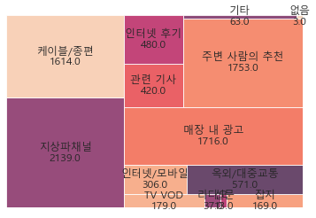

```{r setup, include = FALSE}
knitr::opts_chunk$set(warning = FALSE, fig.align = "center", 
                      fig.height = 8, fig.width = 8,
                      out.width = "100%")
```

# 3. Kobaco 소비자행태조사

마지막 데이터는 한국방송광고진흥공사 (Kobaco)에서 조사한 소비자행태조사(MCR) 데이터입니다.<br>
총 4000명에게 상품 구매에 매체가 미치는 영향을 조사하기 위하여 설문조사를 실시했습니다.<br>
<br>
한 질문에 대해 복수의 답이 가능해서 여러 칼럼에 답이 흩어져 있는 모양입니다.<br>
분석을 위해 한 칼럼으로 합쳐서 분석하기 위한 함수를 생성했습니다.


## 3.1. 라이브러리 불러오기

```{python}
import pandas as pd
import numpy as np
import matplotlib
import matplotlib.pyplot as plt
import seaborn as sns
import matplotlib.font_manager as fm
fm._rebuild()
from collections import Counter
# import squarify
```

```{python}
# matplotlib.rcParams["font.family"] = "AppleGothic"
matplotlib.rcParams["font.family"] = "Malgun Gothic"
matplotlib.rcParams["font.size"] = 12
```

## 3.2. 데이터 불러오기

```{python}
path = r"C:\Users\TFG5076XG\Documents\pythoncodes\data\MCR2019_최종.xlsx"
```

```{python}
df = pd.read_excel(path, sheet_name = 0, engine = "openpyxl")
df.fillna(0, inplace = True)
```

```{python}
df.shape
```

```{python}
temp = df.filter(regex = "^A")
```

## 3.3. EDA

다음과 같은 질문을 기반으로 EDA를 실시했습니다.

-   장르별 애청자의 구매 제품/서비스의 차이가 있을까?

-   매체별 제품/서비스의 구매 영향은 어떨까?

```{python, eval = F}
# 응답자 정보
for name in temp.columns.tolist():
    print(df.loc[:, name].value_counts().sort_index())
```

```{python}
table = pd.DataFrame(temp["A_002"])
```

```{python, message=F}
ax = sns.countplot(data = table,
             x = "A_002").\
set(xticklabels = ["10대", "20대", "30대", "40대", "50대", "60대"])
plt.xlabel("연령대")
plt.ylabel("명")
plt.title("응답자 연령대 분포")
```

응답자의 연령대 분포는 40대와 50대가 가장 많았습니다.

```{python}
# column들을 합치는 함수 combine_cols

def combine_cols(temp_target_df):
    ans_Series = pd.Series("", index = range(len(temp_target_df)))
    for i in range(len(temp_target_df)):
        temp_list = list()
    #     print("-----")
        for j in range(len(temp_target_df.columns)):
    #         print(c_temp.iloc[i, j])
            if temp_target_df.iloc[i, j] == 0:
                pass
            else:
                temp_list.append(temp_target_df.iloc[i, j])
#         print(temp_list)
        ans_Series.iloc[i] = temp_list

    return ans_Series
```

복수 답을 한 칼럼의 리스트 형태로 묶는 함수를 생성했습니다.

```{python}
# 분석용 테이블을 만드는 create_tb

def create_tb(col):
    a_list = list()
    temp[col].apply(lambda x: a_list.append(x))
    a_list = sum(a_list, [])
    a_list_counter = Counter(a_list)
    table = pd.DataFrame.from_dict(a_list_counter, orient='index')
    table = table.drop(labels ="#NULL!", axis = 0)
    table.index = table.index.astype("int64")
    table = table.sort_index()
    
    return table
```

```{python}
col_list = ["C_01_001", "C_01_031", "C_01_034", "J_12_01_009", "J_12_04_010", "J_12_04_011"]
```

```{python}
for col in col_list:
    df[col] = combine_cols(df.filter(regex = col))
```

```{python}
# 예능을 좋아하는 사람들로 필터링
temp = df[df["C_01_001"].apply(lambda x: x.count(7)) == 1]
```

```{python}
a_list = list()
temp["C_01_034"].apply(lambda x: a_list.append(x))
a_list = sum(a_list, [])
a_list_counter = Counter(a_list)
table = pd.DataFrame.from_dict(a_list_counter, orient='index')
table = table.drop(labels ="#NULL!", axis = 0)
table.index = table.index.astype("int64")
table = table.sort_index()
```

```{python}
create_tb("C_01_034")
```

```{python}
new_index = ["자동차",
"일반의류",
"스포츠의류",
"패션잡화",
"휴대폰",
"개인휴대가전",
"생활가전",
"인테리어",
"외식체인점",
"식음료",
"기업/기관",
"국내외 촬영장소",
 "금융",
 "화장품",
 "제약/의료",
 "반려동물 상품",
 "유아용품",
 "게임",
 "기타 앱",
 "박람회/축제",
 "커피전문점"
]
```

```{python}
table.index = new_index
```

```{python}
chart = sns.barplot(data = table,
           x = table.index.values,
           y = table.iloc[:,0])
plt.xticks(rotation = 90)
for p in chart.patches:
#     print(p.get_x())
    chart.annotate(int(p.get_height()),
                  (p.get_x() + p.get_width() / 2., p.get_height()),
                   ha = "center",
                   size = 12
                  )
plt.title("예능 애청자가 TV에서 접한 후 실제로 구입한 제품/서비스")
plt.ylabel("구매 수")
plt.show()
```

예능 애청자들이 TV에서 접한 후 실제로 구입한 제품에는 식음료가 차지하는 비중이 가장 컸습니다. <br>
그렇다면 이러한 추세는 다른 프로그램 장르 애청자에게도 같게 나타날까요?

```{python}
# 국내 드라마를 좋아하는 사람들로 필터링
temp = df[df["C_01_001"].apply(lambda x: x.count(4)) == 1]
```

```{python}
table = create_tb("C_01_034")
```

```{python}
new_index.remove("기업/기관")
```

```{python}
table.index = new_index
```

```{python}
chart = sns.barplot(data = table,
           x = table.index.values,
           y = table.iloc[:,0])
plt.xticks(rotation = 90)
for p in chart.patches:
#     print(p.get_x())
    chart.annotate(int(p.get_height()),
                  (p.get_x() + p.get_width() / 2., p.get_height()),
                   ha = "center",
                   size = 12
                  )
plt.title("국내 드라마 애청자가 TV에서 접한 후 실제로 구입한 제품/서비스")
plt.ylabel("구매 수")
plt.show()
```

국내 드라마 애청자가 TV에서 접한 후 구매한 제품/서비스는 예능 애청자들의 추세와 크게 다르지 않습니다.<br>
다른 장르의 애청자들도 분석해보면 다른 모습이 나타날 수도 있지만, 두 장르만을 비교했을 때는 차이가 없었습니다.

```{python}
table = create_tb("J_12_04_010")
```

```{python}
temp_table = table
```

```{python}
media_index = ["지상파채널",
              "케이블/종편",
              "TV VOD",
              "라디오",
              "신문",
              "잡지",
              "인터넷/모바일",
              "옥외/대중교통",
              "매장 내 광고",
              "관련 기사",
              "인터넷 후기",
              "주변 사람의 추천",
              "기타",
              "없음"]
```

```{python}
table.index = media_index
```

```{python}
chart = sns.barplot(data = table,
           x = table.index.values,
           y = table.iloc[:,0])
plt.xticks(rotation = 90)
for p in chart.patches:
#     print(p.get_x())
    chart.annotate(int(p.get_height()),
                  (p.get_x() + p.get_width() / 2., p.get_height()),
                   ha = "center",
                   size = 12
                  )
plt.title("간편식 브랜드 선택시 영향을 미쳤던 정보 채널")
plt.ylabel("구매 수")
plt.show()
```

<center>


</center>

간편식 브랜드 선택시 영향을 미쳤던 정보 채널에는 지상파 채널, 주변 사람의 추천, 매장 내 광고 등이 있었습니다.

```{python}
table = create_tb("J_12_04_011")
```

```{python}
table.index = media_index
```

```{python}
temp_table = pd.merge(temp_table, table, left_index=True, right_index=True).\
rename(columns = {"0_x":"J_12_04_010", "0_y": "J_12_04_011"})
```

```{python}
chart = sns.barplot(data = table,
           x = table.index.values,
           y = table.iloc[:,0])
plt.xticks(rotation = 90)
for p in chart.patches:
#     print(p.get_x())
    chart.annotate(int(p.get_height()),
                  (p.get_x() + p.get_width() / 2., p.get_height()),
                   ha = "center",
                   size = 12
                  )
plt.title("최근 1달간 간편식 브랜드를 접촉한 채널")
plt.ylabel("구매 수")
plt.show()
```

간편식 브랜드 접촉이 가장 많았던 매체는 지상파채널, 매장 내 광고, 케이블/종편의 순서였습니다. <br>
여전히 기업들이 TV 매체에 돈을 많이 쓰기 때문에 나타나는 현상인 것 같습니다.

```{python}
temp_table["ratio"] = temp_table["J_12_04_010"] / temp_table["J_12_04_011"]
```

브랜드 접촉 대비 상품 구매에 영향이 컸던 정보 채널을 알아보기 위해서 둘을 나눈 'ratio' 변수를 생성했습니다.

```{python}
# 영향을 미친 정보 채널 / 브랜드를 접촉한 채널
# 실제 구매 / 광고량
temp_table.sort_values(by = "ratio", ascending = False)
```

'ratio' 변수를 확인했을 때 값이 높은 순서는 '관련 기사', '옥외/대중교통' 등의 순서였습니다.<br>
간편식 브랜드를 홍보할 때 PR이나 BTL 매체를 적극 활용할 명분이 있다는 것을 알 수 있습니다.<br>
아래 그림은 영향을 미친 정보 채널에 ratio를 곱하여 트리맵 시각화 한 것입니다.

```{python, eval = F}
squarify.plot(temp_table["J_12_04_010"] * temp_table["ratio"],
             label = media_index,
              value = round(temp_table["J_12_04_010"] * temp_table["ratio"], 0),
             alpha = 0.8)
plt.axis("off")
plt.show()
```

<center>

{width="528"}

</center>

